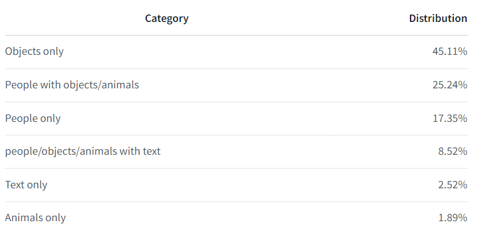
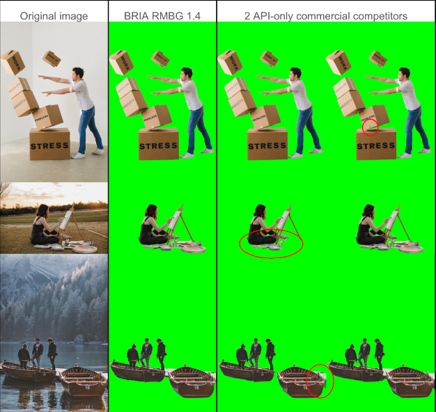

# Proyecto 2: RemoveAI-Usando el modelo de Machine Learning RMBG-1.4

Para este proyecto, se usó el modelo RMGB-1.4, cuya función principal es remover los fondos de las imágenes, siguiendo un rango de categorías y tipo de imágenes. Este modelo est;a entrenado sobre un dataset que incluye imágenes de archivos generales, e-commerce, juegos y demás contenido publicitario, haciéndola útil para casos comerciales y contenidos empresariales.  Cabe destacar que fue desarrollado por BriaAI, compañía que desarrolla contenido visual generativo con IA, por razones comerciales. 

## RMBG-1.4 adaptado para videos:

Este código contiene este modelo de segmentación entrenado sobre un dataset determinado. Dicho modelo fue entrenado sobre unas 12000 imágenes aproximadamente, de alta calidad, resolución, manualmente etiquetadas y con permisos legales para ser usadas sin fines comerciales. 

Según BriaAI, el modelo funciona de mejor forma dependiendo de la categoría de la imagen, siguiend los siguentes datos:



### Imágenes de ejemplo:


Ahora bien, el proyecto solicita aplicar un modelo que le quite los fondos a varios video, para ello, se adaptó el código de la siguiente manera:

### Carga del modelo:
1. Primeramente se carga el modelo de segmentación de imágenes RMBG-1.4 utilizando la función from_pretrained de la biblioteca transformers. Posteriormente, se verifica si hay una GPU disponible y se asigna el modelo al dispositivo correspondiente (GPU si está disponible, de lo contrario, CPU), y por último, se muestra un mensaje indicando quela carga completada del modelo. 

-Snippet:

  ```bash
print("Cargando el modelo...")
model = AutoModelForImageSegmentation.from_pretrained("briaai/RMBG-1.4", trust_remote_code=True)
device = torch.device("cuda:0" if torch.cuda.is_available() else "cpu")
model.to(device)
print("Modelo cargado y enviado a:", device)
```   

### Funciones de preprocesamiento y postprocesamiento:

-Preprocesamiento: Este método verifica si la imagen tiene menos de 3 canales y ajusta su forma si es necesario. Convierte la imagen a un tensor de PyTorch y reordena las dimensiones. Interpola la imagen al tamaño de entrada del modelo utilizando el modo 'bilinear'. Normaliza la imagen dividiendo por 255 y luego normalizando los valores entre 0.5 y 1.0. Devuelve la imagen preprocesada como un tensor de PyTorch.

La interpolación es necesaria porque el modelo de segmentación de imágenes requiere que las imágenes de entrada tengan un tamaño específico. Si la imagen original no coincide con ese tamaño, se necesita interpolar para ajustar las dimensiones. El método de interpolación utilizado es el modo 'bilinear', que es un método común para interpolar imágenes que combina la precisión de la interpolación lineal con la suavidad de la interpolación cuadrática.

El modo 'bilinear' es una técnica de interpolación que combina la precisión de la interpolación lineal con la suavidad de la interpolación cuadrática. Esto permite una interpolación más precisa y suave, especialmente en áreas donde la imagen original tiene pocos píxeles. En este caso, se utiliza para ajustar el tamaño de la imagen de entrada al tamaño de entrada del modelo.

Por otro lado, la normalización permite lograr cierta uniformidad entre las imágenes, estandarizando sus dimensiones como el ancho de las letras y su tamaño vertical.

-Snippet:

```bash
def preprocess_image(im: np.ndarray, model_input_size: list) -> torch.Tensor:
    if len(im.shape) < 3:
        im = im[:, :, np.newaxis]
    im_tensor = torch.tensor(im, dtype=torch.float32).permute(2, 0, 1)
    im_tensor = F.interpolate(torch.unsqueeze(im_tensor, 0), size=model_input_size, mode='bilinear')
    image = torch.divide(im_tensor, 255.0)
    image = normalize(image, [0.5, 0.5, 0.5], [1.0, 1.0, 1.0])
    return image

```    
-Postprocesamiento: Interpola el resultado de la segmentación al tamaño original de la imagen. Lo que hace es calcular el máximo y mínimo de los valores en el resultado, para luego normalizar los valores del resultado entre 0 y 1. Posteriormente, convierte el resultado a un array de NumPy con valores entre 0 y 255, y luego reordena las dimensiones del array y lo convierte a un array de tipo uint8. Al final devuelve el array de la imagen postprocesada.

-Snippet:

```bash
def postprocess_image(result: torch.Tensor, im_size: list) -> np.ndarray:
    result = torch.squeeze(F.interpolate(result, size=im_size, mode='bilinear'), 0)
    ma = torch.max(result)
    mi = torch.min(result)
    result = (result - mi) / (ma - mi)
    im_array = (result * 255).permute(1, 2, 0).cpu().data.numpy().astype(np.uint8)
    im_array = np.squeeze(im_array)
    return im_array

```    

### Función para procesar videos:

El procesamiento se lleva a cabo primeramente abriendo el video usando OpenCV, y verifica si se abre correctamente. Luego se obtienen las dimensiones del video, incluyendo el alto, ancho y la frecuencia de frames por segundo. Esto se usa para crear un video de salida, creando un objeto "VideoWriter" para escribir dicho video, utilizando un códec o formato DIVX y colocando las dimensiones y FPS del video de entrada.

```bash
def process_video(input_video_path, output_video_path, model, model_input_size):
    print(f"Abriendo el video de entrada: {input_video_path}")
    cap = cv2.VideoCapture(input_video_path)
    if not cap.isOpened():
        print(f"Error al abrir el video de entrada: {input_video_path}")
        return
    
    frame_width = int(cap.get(cv2.CAP_PROP_FRAME_WIDTH))
    frame_height = int(cap.get(cv2.CAP_PROP_FRAME_HEIGHT))
    fps = cap.get(cv2.CAP_PROP_FPS)
    
    fourcc = cv2.VideoWriter_fourcc(*'DIVX')
    out = cv2.VideoWriter(output_video_path, fourcc, fps, (frame_width, frame_height), True)
    
    if not out.isOpened():
        print(f"Error al crear el video de salida: {output_video_path}")
        return

```   

Posteriormente, se aplica la lectura de cada cuadro, aplicando el preprocesamiento, luego aplicando el modelo (inferencia) para segmentar la imágen y por último el postprocesamiento.

```bash
 frame_count = 0
    while cap.isOpened():
        ret, frame = cap.read()
        if not ret:
            break

        frame_count += 1
        print(f"Procesando cuadro {frame_count}")
        orig_im_size = frame.shape[0:2]
        image = preprocess_image(frame, model_input_size).to(device)

        # Inferencia
        with torch.no_grad():
            result = model(image)
        
        # Ajustar el acceso al resultado según la estructura real
        if isinstance(result, tuple):
            result = result[0]

        # Post-proceso
        result_image = postprocess_image(result[0], orig_im_size)
```   
Por último, se crea la imagen con el fondo transparente, se convierte en formato OpenCV, luego  se verifica si las dimensiones del cuadro procesado coinciden con las dimensiones del video de salida. Si no coinciden, se imprime un mensaje de error y se devuelve. Al final sale el cuadro procesado en el video de salida.

```bash
  # Crear una imagen con fondo transparente
        pil_im = Image.fromarray(result_image)
        no_bg_image = Image.new("RGBA", pil_im.size, (0, 0, 0, 0))
        orig_image = Image.fromarray(cv2.cvtColor(frame, cv2.COLOR_BGR2RGB))
        no_bg_image.paste(orig_image, mask=pil_im)

        # Convertir de vuelta a formato de OpenCV
        no_bg_image = cv2.cvtColor(np.array(no_bg_image), cv2.COLOR_RGBA2BGRA)

        # Verificar las dimensiones del cuadro
        if no_bg_image.shape[1] != frame_width or no_bg_image.shape[0] != frame_height:
            print(f"Error: Las dimensiones del cuadro {frame_count} no coinciden con el video de salida")
            print(f"Dimensiones del cuadro: {no_bg_image.shape[1]}x{no_bg_image.shape[0]}, Dimensiones esperadas: {frame_width}x{frame_height}")
            return
        
        # Convertir el frame a un formato compatible con VideoWriter (BGR)
        bgr_frame = cv2.cvtColor(no_bg_image, cv2.COLOR_BGRA2BGR)

        # Escribir el cuadro en el archivo de video
        out.write(bgr_frame)

    cap.release()
    out.release()
    print("Procesamiento de video completado.")

```   